# 👁️ ARGUS
**ARGUS** — **A**WS **R**eliability, **G**overnance, **U**ptime & **S**ecurity


> **ARGUS** is a hands-on AWS Site Reliability Engineering (SRE) / DevOps project designed to build and demonstrate practical skills across cloud infrastructure, Linux, automation, Infrastructure as Code, CI/CD, containers, databases, networking, observability, security, and production troubleshooting.

---

# 📖 Table of Contents

- [🎯 Project Vision](#-project-vision)
- [🔤 ARGUS Acronym](#-argus-acronym)
- [💼 Job Description](#-job-description)
- [🧰 Desirable Experience](#-desirable-experience)
- [🎯 Required Experience](#-required-experience)
- [🗺️ Complete Skill Mindmap](#️-complete-skill-mindmap)
- [🏗️ ARGUS Architecture](#️-argus-architecture)
- [☁️ AWS Infrastructure](#️-aws-infrastructure)
- [🐧 Linux & Bash](#-linux--bash)
- [🗄️ Databases](#️-databases)
- [🔀 Source Control & CI/CD](#-source-control--cicd)
- [🐳 Containers & Orchestration](#-containers--orchestration)
- [🏗️ Infrastructure as Code](#️-infrastructure-as-code)
- [⚙️ Configuration Management](#️-configuration-management)
- [📊 Monitoring & Observability](#-monitoring--observability)
- [🌐 Networking](#-networking)
- [🔐 Security](#-security)
- [🤖 Automation](#-automation)
- [🚨 Troubleshooting](#-troubleshooting)
- [🔄 SRE Operating Model](#-sre-operating-model)
- [🎓 Education & Qualifications](#-education--qualifications)
- [⭐ Capability Matrix](#-capability-matrix)
- [🧭 Learning Roadmap](#-learning-roadmap)
- [📁 Suggested Repository Structure](#-suggested-repository-structure)
- [🏆 Ideal Candidate](#-ideal-candidate)

---

# 🎯 Project Vision

ARGUS is intended to function as a **practical SRE/DevOps laboratory** rather than a collection of disconnected technology tutorials.

The project brings the following disciplines together:

```text
                    👁️ ARGUS
                      │
        ┌─────────────┼─────────────┐
        │             │             │
      BUILD         OPERATE       OBSERVE
        │             │             │
      CI/CD         AWS/Linux     Monitoring
        │             │             │
    Containers     Networking    Alerting
        │             │             │
        └─────────────┼─────────────┘
                      │
                  AUTOMATE
                      │
             Terraform / Ansible
                 Python / Bash
                      │
                      ▼
                🔐 RELIABLE
                 AWS SYSTEMS
```

---

# 🔤 ARGUS Acronym

**A — AWS** 
Cloud infrastructure, compute, networking, security, storage, databases and managed services.
**R — Reliability**
Availability, resilience, performance, incident response, troubleshooting and operational excellence.
**G — Governance**
Infrastructure standards, secure configuration, automation standards, access control and operational best practices.
**U — Uptime**
Monitoring, observability, alerting, capacity, performance and proactive reliability engineering.
**S — Security**
Cloud security, least privilege, network security, hardening, auditing and secure operations.

---

# 💼 Job Description

## 📌 Role

**AWS Site Reliability Engineer (SRE) / DevOps Engineer**

The role focuses on **AWS infrastructure, reliability engineering, automation, CI/CD, Linux systems, containers, Infrastructure as Code, observability, security and troubleshooting**.

---

# 🧰 Desirable Experience

| Category | Technologies / Experience |
|---|---|
| 🐧 **Operating Systems** | Amazon Linux, RHEL, CentOS, Fedora, Ubuntu, Debian |
| 💻 **Shell Scripting** | Bash / BASH |
| 🗄️ **SQL Databases** | PostgreSQL and similar relational databases |
| 🗃️ **NoSQL Databases** | DynamoDB and similar NoSQL databases |
| 🔀 **Source Control** | Git, GitLab, GitHub |
| 🐍 **Programming** | Python and other modern programming languages |
| 🐳 **Containers** | Docker |
| ☸️ **Orchestration** | Kubernetes, Nomad |
| 🏗️ **Infrastructure Provisioning** | Terraform |
| ⚙️ **Configuration Management** | Ansible |
| 📊 **Monitoring & Alerting** | CloudWatch, Prometheus, Grafana, Datadog |
| 🚀 **Build & Deployment** | Jenkins, GitLab CI/CD, AWS CodeBuild |

---

# 🎯 Required Experience

- **2–5 years of experience** as a Site Reliability Engineer, DevOps Engineer, Systems Administrator, or similar role.
- Exposure to **AWS-based infrastructure**.
- Experience working with **Linux systems**.
- Familiarity with **database administration**.
- Automation mindset with practical **automation/scripting experience**.
- Understanding of **systems performance, tuning and monitoring**.
- Knowledge of **networking fundamentals and configuration**.
- Understanding of best practices for operating a **secure environment on public cloud infrastructure**.
- Ability to work in a **fast-paced, collaborative work environment**.
- **Effective communication skills**.
- **Strong troubleshooting skills** across different parts of the technology stack.
- Relevant **3rd-level degree** and/or equivalent work experience and/or professional qualification.

---

# 🗺️ Complete Skill Mindmap

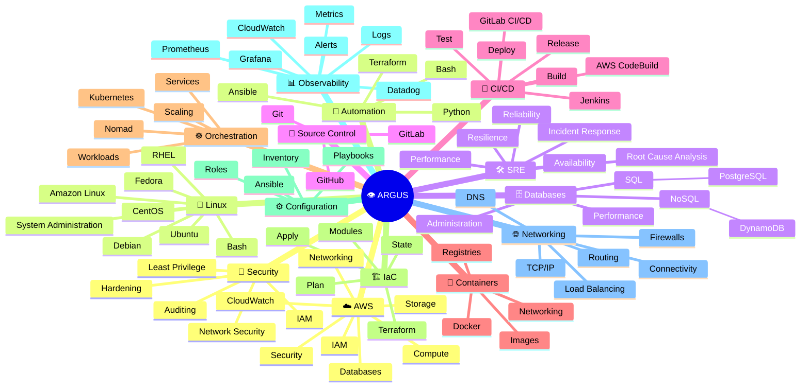

---

# 🏗️ ARGUS Architecture

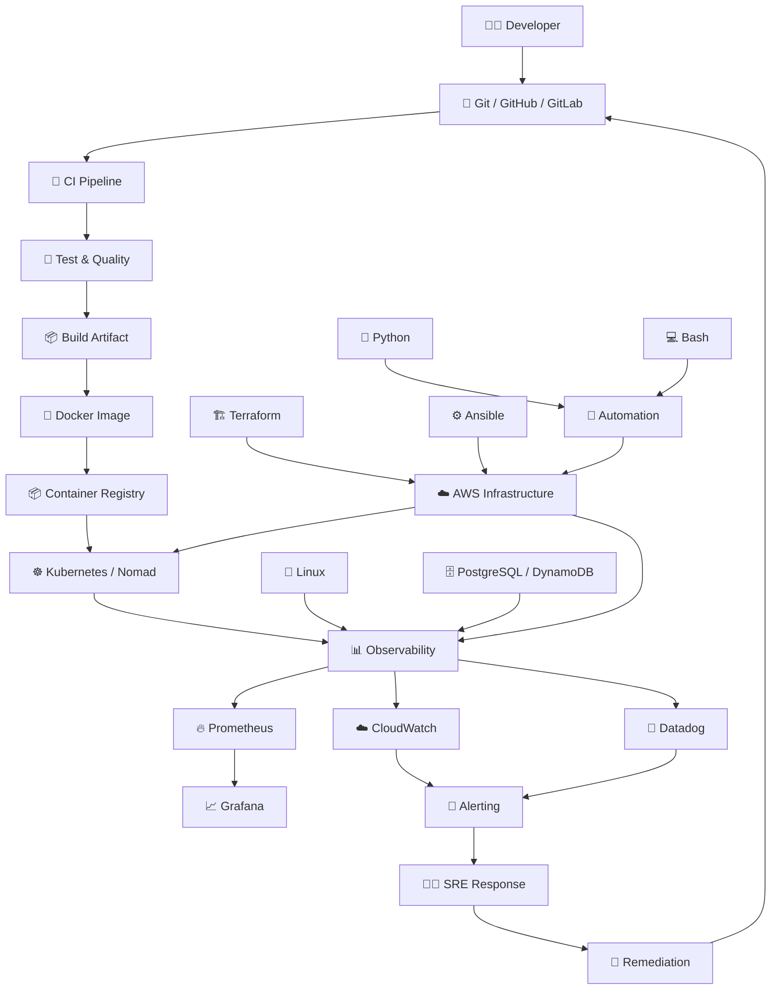

---

# ☁️ AWS Infrastructure

ARGUS uses AWS as the primary cloud environment.

### Core areas

| Area | Focus |
|---|---|
| ☁️ Cloud Infrastructure | Provisioning and operating AWS resources |
| 🖥️ Compute | Workloads and compute capacity |
| 🌐 Networking | Connectivity, routing and traffic management |
| 🔐 IAM | Identity, permissions and least privilege |
| 🗄️ Databases | SQL and NoSQL workloads |
| 📊 CloudWatch | AWS metrics, logs, dashboards and alarms |
| 🛡️ Security | Secure cloud operation and hardening |

### AWS Infrastructure Flow

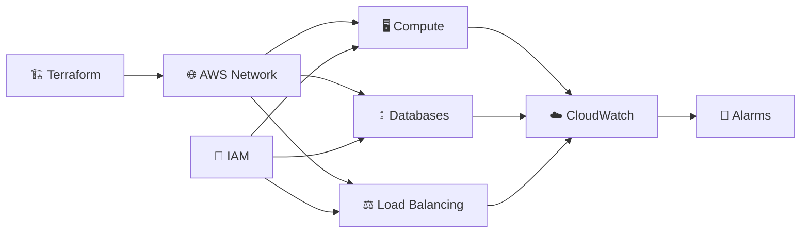

---

# 🐧 Linux & Bash

## Supported Linux Families

- Amazon Linux
- RHEL
- CentOS
- Fedora
- Ubuntu
- Debian

## Bash Skills

- Linux CLI
- File and process management
- Permissions
- Services
- Package management
- Logs
- Networking commands
- Shell scripting
- Operational automation

### Linux Operations Mindmap

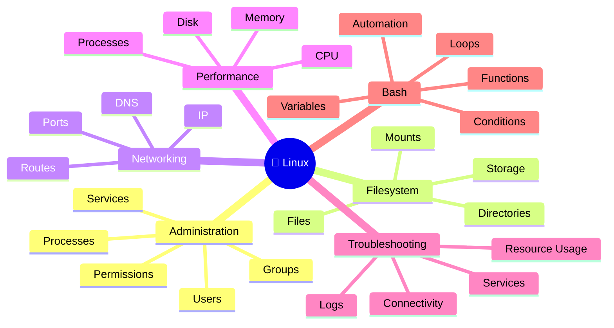

### Linux Troubleshooting Flow

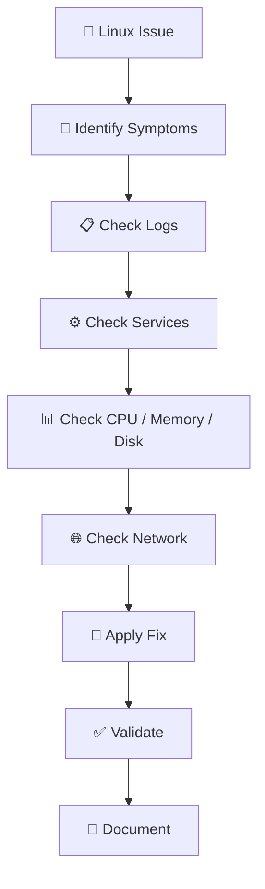

---

# 🗄️ Databases

## SQL — PostgreSQL

Expected familiarity includes:

- SQL queries
- Relational database concepts
- Users and permissions
- Backups
- Connections
- Basic administration
- Performance considerations

## NoSQL — DynamoDB

Expected familiarity includes:

- NoSQL concepts
- Tables and items
- Partition keys
- Query patterns
- Scalability
- Cloud-native database operations

### Database Mindmap

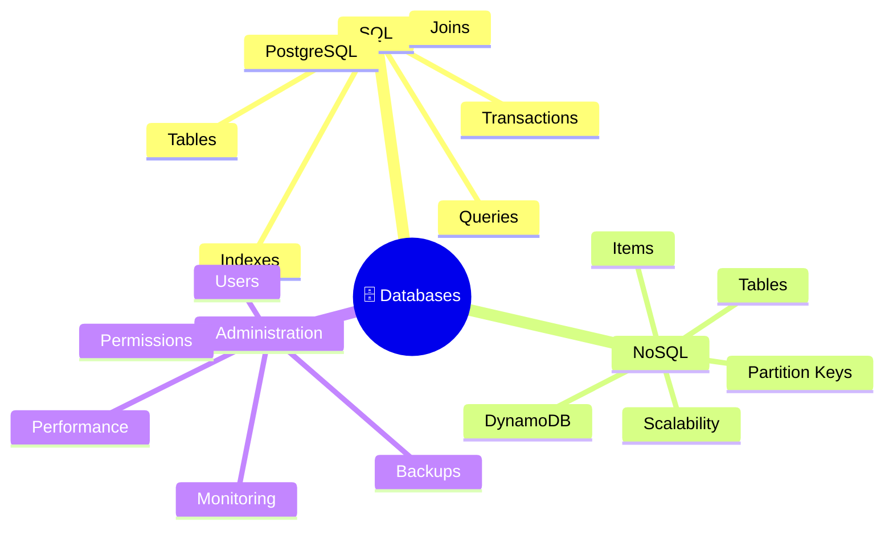

### Database Operations

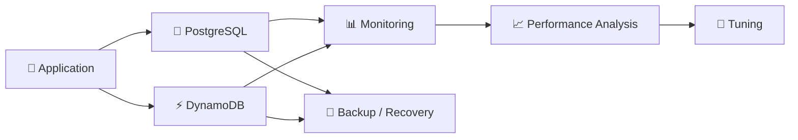

---

# 🔀 Source Control & CI/CD

## Source Control

- Git
- GitHub
- GitLab

## CI/CD

- Jenkins
- GitLab CI/CD
- AWS CodeBuild

### CI/CD Mindmap

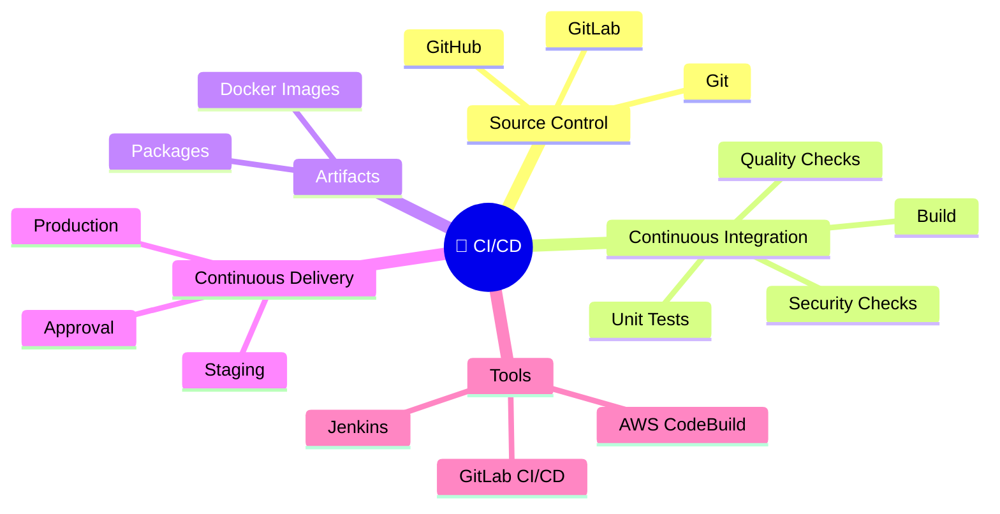

### CI/CD Pipeline

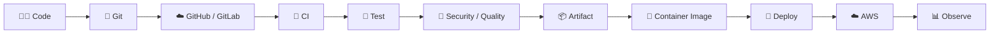

---

# 🐳 Containers & Orchestration

## Docker

- Dockerfiles
- Images
- Containers
- Registries
- Networking
- Volumes
- Container lifecycle

## Kubernetes

- Pods
- Deployments
- Services
- ConfigMaps
- Secrets
- Scaling
- Networking
- Workloads

## Nomad

- Job scheduling
- Workload orchestration
- Cluster operations
- Container workloads

### Container Architecture

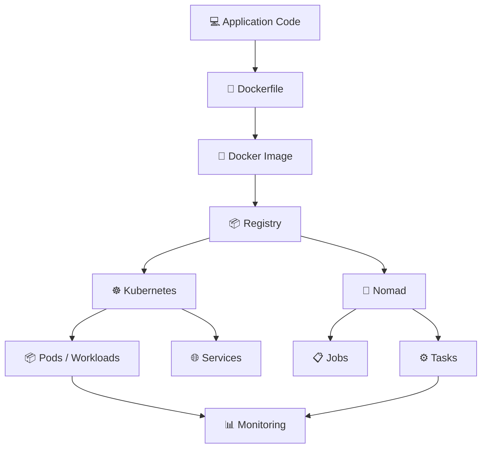

---

# 🏗️ Infrastructure as Code

## Terraform

ARGUS uses Terraform to provision repeatable infrastructure.

### Key concepts

- Providers
- Resources
- Variables
- Outputs
- Modules
- State
- Plan
- Apply
- Import
- Environment separation

### Terraform Workflow

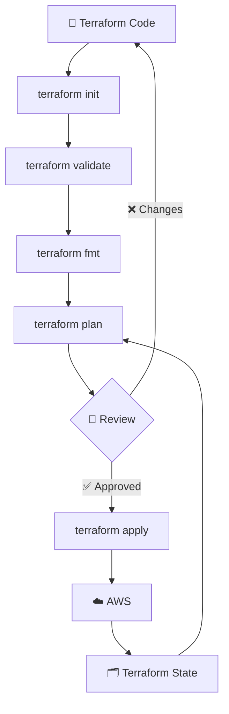

### Terraform Mindmap

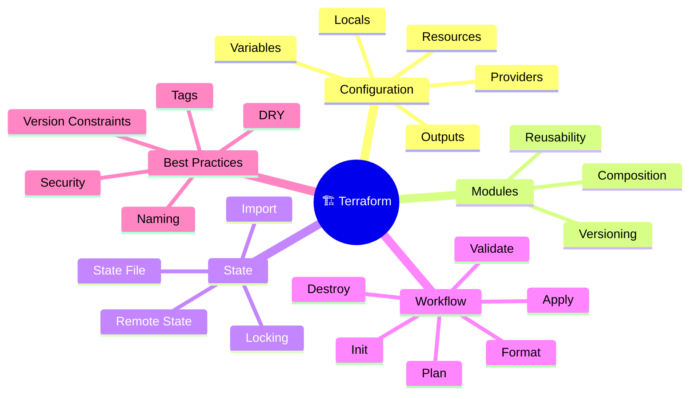

---

# ⚙️ Configuration Management

## Ansible

Ansible provides configuration management and operational automation.

### Areas

- Inventory
- Playbooks
- Roles
- Variables
- Tasks
- Handlers
- Templates
- Package management
- Server configuration

### Ansible Flow

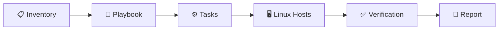

---

# 📊 Monitoring & Observability

Observability is a core part of ARGUS.

## Tools

| Tool | Purpose |
|---|---|
| ☁️ **CloudWatch** | AWS metrics, logs and alarms |
| 🔥 **Prometheus** | Metrics collection and querying |
| 📈 **Grafana** | Visualization and dashboards |
| 📡 **Datadog** | Infrastructure and application observability |

### Observability Mindmap

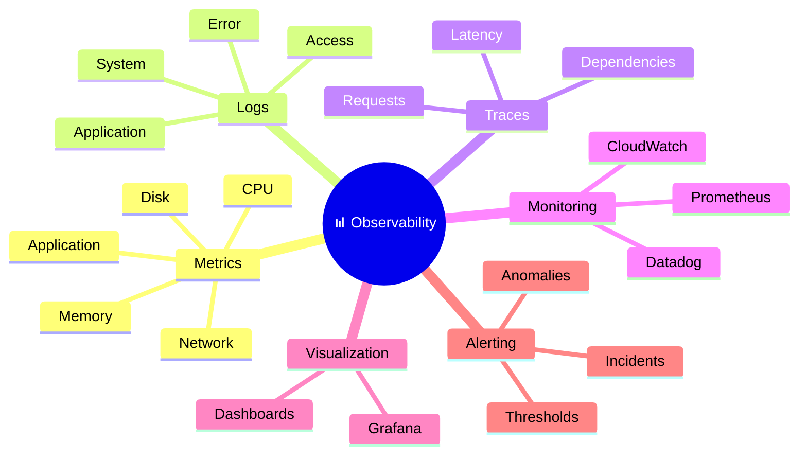

### Observability Pipeline

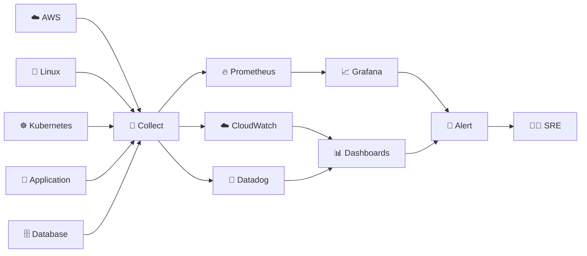

---

# 🌐 Networking

Networking fundamentals and configuration are required for effective infrastructure troubleshooting.

### Key areas

- TCP/IP
- IP addressing
- DNS
- Ports
- Routing
- Load balancing
- Firewalls
- Security groups
- Network connectivity
- HTTP/HTTPS

### Networking Mindmap

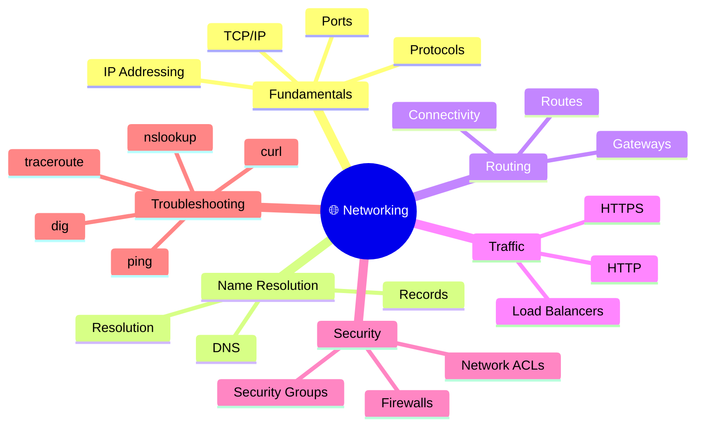

### Network Troubleshooting

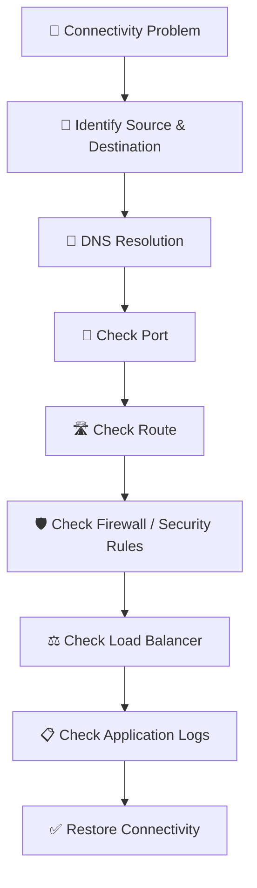

---

# 🔐 Security

ARGUS incorporates secure cloud operation as a core requirement.

### Security areas

- IAM
- Least privilege
- Secure credentials
- Network security
- Infrastructure hardening
- Secrets management
- Logging and auditing
- Secure CI/CD
- Secure container practices
- Infrastructure security

### Security Mindmap

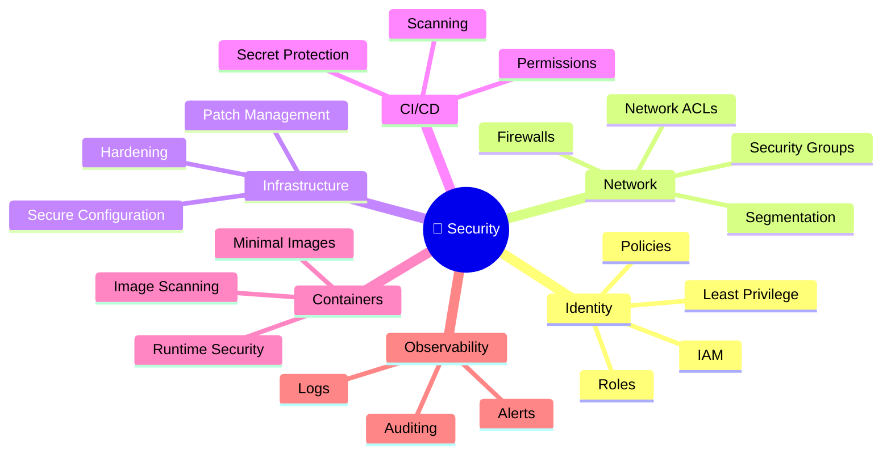

### Secure Cloud Model

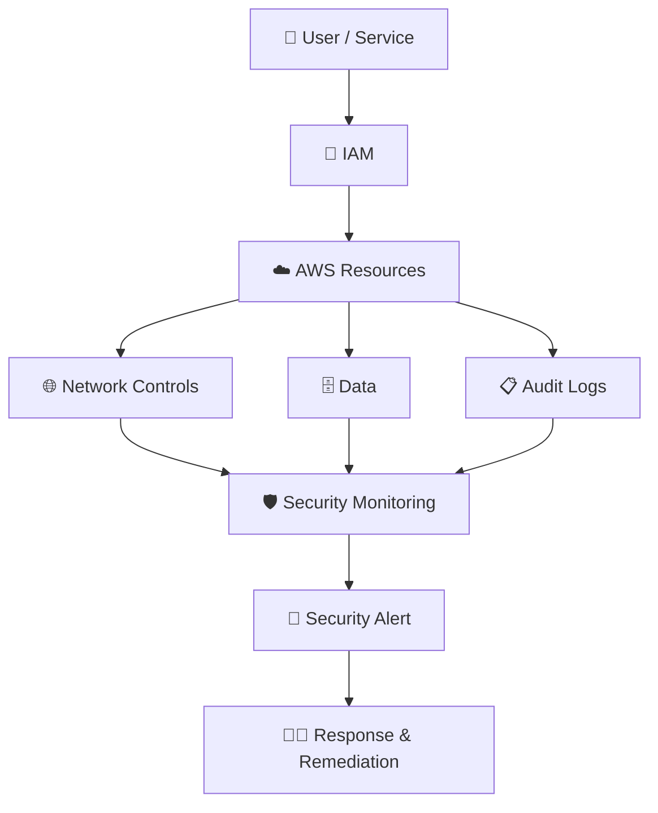

---

# 🤖 Automation

Automation is one of the central SRE principles in ARGUS.

### Automation stack

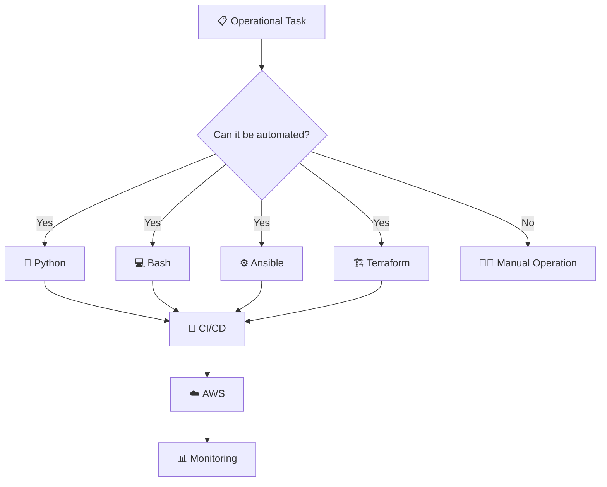

### Automation principles

- Automate repetitive tasks.
- Make infrastructure reproducible.
- Reduce manual configuration.
- Build idempotent operations where possible.
- Validate changes automatically.
- Integrate automation into CI/CD.
- Monitor automated workflows.

---

# 🚨 Troubleshooting

Strong troubleshooting across the stack is a major requirement of the role.

### Troubleshooting Mindmap

```mermaid
mindmap
  root((🚨 Troubleshooting))
    Cloud
      AWS
      Compute
      Storage
      IAM
    OS
      Linux
      Processes
      Services
      Logs
    Network
      DNS
      Ports
      Routes
      Firewalls
    Containers
      Docker
      Kubernetes
      Nomad
    Database
      PostgreSQL
      DynamoDB
      Connections
      Performance
    CI/CD
      Build
      Test
      Artifacts
      Deployment
    Application
      Logs
      Errors
      Dependencies
      Latency
    Observability
      Metrics
      Logs
      Alerts
      Dashboards
```

### Cross-Stack Incident Response

```mermaid
flowchart TD
    INCIDENT["🚨 Production Incident"] --> DETECT["📡 Detect"]
    DETECT --> TRIAGE["🔎 Triage"]
    TRIAGE --> METRICS["📊 Metrics"]
    TRIAGE --> LOGS["📋 Logs"]
    TRIAGE --> NETWORK["🌐 Network"]
    TRIAGE --> OS["🐧 OS"]
    TRIAGE --> APP["🚀 Application"]
    TRIAGE --> DB["🗄️ Database"]
    TRIAGE --> CONTAINER["🐳 Container"]

    METRICS --> RCA["🧠 Root Cause Analysis"]
    LOGS --> RCA
    NETWORK --> RCA
    OS --> RCA
    APP --> RCA
    DB --> RCA
    CONTAINER --> RCA

    RCA --> REMEDIATE["🔧 Remediation"]
    REMEDIATE --> VALIDATE["✅ Validate"]
    VALIDATE --> MONITOR["📈 Monitor"]
    MONITOR --> DOCUMENT["📝 Document"]
    DOCUMENT --> IMPROVE["🔄 Continuous Improvement"]
```

---

# 🔄 SRE Operating Model

ARGUS follows a continuous reliability loop:

```mermaid
flowchart LR
    PLAN["📝 Plan"] --> BUILD["🔨 Build"]
    BUILD --> DEPLOY["🚀 Deploy"]
    DEPLOY --> OPERATE["⚙️ Operate"]
    OPERATE --> OBSERVE["📊 Observe"]
    OBSERVE --> ALERT["🚨 Alert"]
    ALERT --> RESPOND["👨‍🔧 Respond"]
    RESPOND --> RECOVER["✅ Recover"]
    RECOVER --> ANALYZE["🧠 Analyze"]
    ANALYZE --> IMPROVE["🔄 Improve"]
    IMPROVE --> PLAN
```

### SRE Principles

```mermaid
mindmap
  root((👨‍🔧 SRE))
    Reliability
      Availability
      Resilience
      Recovery
    Observability
      Metrics
      Logs
      Alerts
    Automation
      Reduce Toil
      Repeatability
      Self Service
    Performance
      Capacity
      Latency
      Tuning
    Incident Management
      Detection
      Response
      RCA
      Postmortem
    Security
      Least Privilege
      Hardening
      Auditing
    Continuous Improvement
      Lessons Learned
      Automation
      Optimization
```

---

# 🎓 Education & Qualifications

The job description specifies:

- Relevant **3rd-level degree**, and/or
- Equivalent **work experience**, and/or
- Relevant **professional qualification**.

Professional certifications relevant to this ecosystem may include cloud, DevOps, Kubernetes, Terraform, Linux and security certifications.

---

# ⭐ Capability Matrix

| Capability | Priority |
|---|:---:|
| ☁️ AWS | ⭐⭐⭐⭐⭐ |
| 🐧 Linux | ⭐⭐⭐⭐⭐ |
| ⚙️ Automation | ⭐⭐⭐⭐⭐ |
| 🛠️ Troubleshooting | ⭐⭐⭐⭐⭐ |
| 🏗️ Terraform | ⭐⭐⭐⭐ |
| 🔀 CI/CD | ⭐⭐⭐⭐ |
| 🐳 Docker | ⭐⭐⭐⭐ |
| ☸️ Kubernetes | ⭐⭐⭐⭐ |
| 📊 Monitoring / Observability | ⭐⭐⭐⭐ |
| 🌐 Networking | ⭐⭐⭐⭐ |
| 🔐 Cloud Security | ⭐⭐⭐⭐ |
| 🐍 Python / Bash | ⭐⭐⭐ |
| 🗄️ Databases | ⭐⭐⭐ |
| ⚙️ Ansible | ⭐⭐⭐ |
| 🚢 Nomad | ⭐⭐ |
| 💬 Communication | ⭐⭐⭐⭐ |

---

# 🧭 Learning Roadmap

```mermaid
flowchart LR
    A["01 🐧 Linux"] --> B["02 💻 Bash"]
    B --> C["03 🌐 Networking"]
    C --> D["04 ☁️ AWS"]
    D --> E["05 🔀 Git"]
    E --> F["06 🚀 CI/CD"]
    F --> G["07 🐍 Python"]
    G --> H["08 🐳 Docker"]
    H --> I["09 ☸️ Kubernetes"]
    I --> J["10 🏗️ Terraform"]
    J --> K["11 ⚙️ Ansible"]
    K --> L["12 🗄️ Databases"]
    L --> M["13 📊 Observability"]
    M --> N["14 🔐 Security"]
    N --> O["15 🚨 SRE Troubleshooting"]
    O --> P["🏆 Production-Ready SRE"]
```

### Learning Phases

| Phase | Focus | Outcome |
|---:|---|---|
| 01 | 🐧 Linux | System administration foundation |
| 02 | 💻 Bash | Shell automation |
| 03 | 🌐 Networking | Connectivity troubleshooting |
| 04 | ☁️ AWS | Cloud infrastructure |
| 05 | 🔀 Git | Source control |
| 06 | 🚀 CI/CD | Automated delivery |
| 07 | 🐍 Python | Advanced automation |
| 08 | 🐳 Docker | Containerization |
| 09 | ☸️ Kubernetes | Orchestration |
| 10 | 🏗️ Terraform | Infrastructure as Code |
| 11 | ⚙️ Ansible | Configuration management |
| 12 | 🗄️ Databases | Database operations |
| 13 | 📊 Observability | Monitoring and alerting |
| 14 | 🔐 Security | Secure cloud operations |
| 15 | 🚨 SRE | Reliability and incident response |

---

# 📁 Suggested Repository Structure

```text
ARGUS/
│
├── 📄 README.md
│
├── ☁️ aws/
│   ├── networking/
│   ├── compute/
│   ├── iam/
│   ├── storage/
│   └── monitoring/
│
├── 🐧 linux/
│   ├── administration/
│   ├── bash/
│   ├── troubleshooting/
│   └── performance/
│
├── 🏗️ terraform/
│   ├── modules/
│   ├── environments/
│   ├── dev/
│   └── prod/
│
├── ⚙️ ansible/
│   ├── inventories/
│   ├── playbooks/
│   └── roles/
│
├── 🐳 docker/
│   ├── applications/
│   ├── Dockerfiles/
│   └── compose/
│
├── ☸️ kubernetes/
│   ├── deployments/
│   ├── services/
│   ├── configmaps/
│   └── secrets/
│
├── 🚀 cicd/
│   ├── jenkins/
│   ├── gitlab/
│   └── codebuild/
│
├── 🐍 python/
│   ├── automation/
│   ├── monitoring/
│   └── utilities/
│
├── 🗄️ databases/
│   ├── postgresql/
│   └── dynamodb/
│
├── 📊 observability/
│   ├── prometheus/
│   ├── grafana/
│   ├── cloudwatch/
│   └── datadog/
│
├── 🌐 networking/
│
├── 🔐 security/
│
├── 🚨 troubleshooting/
│
└── 📚 docs/
    ├── architecture/
    ├── runbooks/
    ├── incidents/
    └── learning-notes/
```

---

# 🏆 Ideal Candidate Profile

The ideal ARGUS candidate is a **hands-on AWS SRE / DevOps engineer** capable of operating, automating, monitoring and troubleshooting modern cloud infrastructure.

### The candidate should be able to:

- ☁️ Operate **AWS infrastructure**.
- 🐧 Administer and troubleshoot **Linux systems**.
- 💻 Write **Bash scripts**.
- 🐍 Build operational automation with **Python**.
- 🔀 Use **Git, GitHub and GitLab**.
- 🚀 Build and maintain **CI/CD pipelines**.
- 🐳 Build and operate **Docker containers**.
- ☸️ Understand **Kubernetes and Nomad**.
- 🏗️ Provision infrastructure with **Terraform**.
- ⚙️ Configure systems with **Ansible**.
- 🗄️ Work with **PostgreSQL and DynamoDB**.
- 📊 Implement **monitoring and observability**.
- 🔔 Configure and respond to **alerts**.
- 🌐 Troubleshoot **networking and connectivity**.
- 🔐 Apply **cloud security best practices**.
- 🚨 Perform **incident response and root-cause analysis**.
- 📈 Improve **reliability, performance and operational efficiency**.
- 🤝 Communicate effectively in a collaborative environment.

---

# 🧩 ARGUS Technology Map

```mermaid
flowchart TB
    ARGUS["👁️ ARGUS<br/>AWS Reliability, Governance,<br/>Uptime & Security"]

    ARGUS --> AWS["☁️ AWS"]
    ARGUS --> LINUX["🐧 Linux"]
    ARGUS --> DEVOPS["🚀 DevOps"]
    ARGUS --> IAC["🏗️ Infrastructure as Code"]
    ARGUS --> CONTAINERS["🐳 Containers"]
    ARGUS --> DATABASES["🗄️ Databases"]
    ARGUS --> OBS["📊 Observability"]
    ARGUS --> NETWORK["🌐 Networking"]
    ARGUS --> SECURITY["🔐 Security"]
    ARGUS --> AUTOMATION["🤖 Automation"]
    ARGUS --> SRE["🛠️ SRE"]

    AWS --> AWS1["Compute"]
    AWS --> AWS2["IAM"]
    AWS --> AWS3["Networking"]
    AWS --> AWS4["CloudWatch"]

    LINUX --> L1["Amazon Linux"]
    LINUX --> L2["Ubuntu"]
    LINUX --> L3["Bash"]

    DEVOPS --> D1["Git"]
    DEVOPS --> D2["Jenkins"]
    DEVOPS --> D3["GitLab CI/CD"]
    DEVOPS --> D4["AWS CodeBuild"]

    IAC --> I1["Terraform"]
    IAC --> I2["Ansible"]

    CONTAINERS --> C1["Docker"]
    CONTAINERS --> C2["Kubernetes"]
    CONTAINERS --> C3["Nomad"]

    DATABASES --> DB1["PostgreSQL"]
    DATABASES --> DB2["DynamoDB"]

    OBS --> O1["Prometheus"]
    OBS --> O2["Grafana"]
    OBS --> O3["CloudWatch"]
    OBS --> O4["Datadog"]

    NETWORK --> N1["DNS"]
    NETWORK --> N2["Routing"]
    NETWORK --> N3["TCP/IP"]
    NETWORK --> N4["Load Balancing"]

    SECURITY --> S1["IAM"]
    SECURITY --> S2["Hardening"]
    SECURITY --> S3["Least Privilege"]
    SECURITY --> S4["Auditing"]

    AUTOMATION --> A1["Python"]
    AUTOMATION --> A2["Bash"]
    AUTOMATION --> A3["Ansible"]
    AUTOMATION --> A4["Terraform"]

    SRE --> R1["Reliability"]
    SRE --> R2["Performance"]
    SRE --> R3["Incident Response"]
    SRE --> R4["Troubleshooting"]
```

---

# 📌 Project Goal

> **Build, operate, monitor, secure and troubleshoot a production-style AWS environment using modern SRE and DevOps practices.**

ARGUS should ultimately demonstrate the ability to move from:

**Code → Infrastructure → Deployment → Operations → Observability → Incident Response → Continuous Improvement**

```mermaid
flowchart LR
    CODE["💻 Code"] --> INFRA["🏗️ Infrastructure"]
    INFRA --> DEPLOY["🚀 Deployment"]
    DEPLOY --> OPERATE["⚙️ Operations"]
    OPERATE --> OBSERVE["📊 Observability"]
    OBSERVE --> INCIDENT["🚨 Incident"]
    INCIDENT --> RCA["🧠 RCA"]
    RCA --> AUTOMATE["🤖 Automate"]
    AUTOMATE --> IMPROVE["📈 Improve"]
    IMPROVE --> CODE
```

---

# 👁️ ARGUS Philosophy

### **Observe → Automate → Secure → Troubleshoot → Improve**

```mermaid
flowchart LR
    OBS["👁️ Observe"] --> AUTO["🤖 Automate"]
    AUTO --> SEC["🔐 Secure"]
    SEC --> TROUBLE["🛠️ Troubleshoot"]
    TROUBLE --> IMPROVE["📈 Improve"]
    IMPROVE --> OBS
```

---

## 🏁 End State

When complete, **ARGUS** should serve as a practical portfolio and learning project demonstrating the core competencies expected from an **AWS SRE / DevOps Engineer**.

> **👁️ ARGUS — AWS Reliability, Governance, Uptime & Security**
>
> *Build it. Automate it. Observe it. Secure it. Troubleshoot it. Improve it.*
